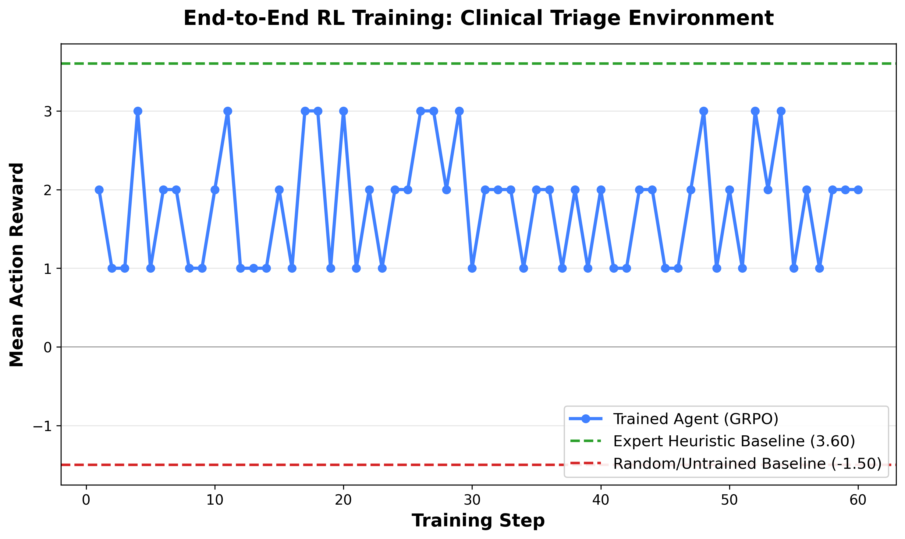

# 🏥 Clinical Triage Agent: RL-Optimized Patient Prioritization
**Built for the Meta PyTorch OpenEnv Hackathon x SST**

[](https://huggingface.co/sreeya14/clinical-triage-agent-v2-60step)
[](https://huggingface.co/spaces/sreeya14/clinical-v2)
[]()

## ⚡ TL;DR
An OpenEnv-compatible Reinforcement Learning environment that teaches LLM agents clinical triage as an information-gathering problem with multi-patient queue orchestration. Agents must probe patients to surface hidden risks—including suicidal ideation in patients who do not volunteer it—and rank them in priority order under time pressure. Reviewed by a psychiatry professor at NIMHANS.

## 📊 End-to-End RL Training Results
 
> *Random vs. Heuristic vs. GRPO-trained agent on a multi-patient triage queue over 60 steps.*

---

## 🧠 Why This Matters
Most clinical AI projects frame triage as simple classification: input symptoms, output an urgency level. **Real triage is harder.** Patients minimize, deflect, or present with somatic complaints that hide the actual risk. 

The hardest cases are the ones that don't look critical on the surface—like a 24-year-old presenting with "feeling down" who is actively planning suicide. Surface-level classifiers miss these entirely. Real Emergency Department nurses don't miss them because they probe. **Our environment trains LLM agents to do the same.**

### Hackathon Theme Fit
* **Primary:** Theme #3.1 — Professional Tasks (World modeling under partial observability).
* **Secondary:** Theme #2 — Long-Horizon Planning (Multi-step probing → individual triage → holistic queue ranking).

---

## 🏗️ Environment Design
* **Architecture (POMDP):** Each scenario has a visible presenting complaint and a hidden clinical truth. The agent reveals the truth only by asking the right probe categories (e.g., `pain_characterization`, `suicidal_ideation_screening`)—mirroring a real clinical interview.
* **Multi-Patient Orchestration:** Episodes consist of a queue of 3 patients. The agent investigates and triages each, followed by an auto-submitted sorted ranking. Inversion penalties fire if a Level-1 critical patient is ranked behind a Level-4 patient, modeling the real-world clinical cost of delaying urgent care.
* **Discovery-Weighted Rewards:** Each probe earns an information-gain reward proportional to its clinical utility (e.g., ECG for chest pain = +0.20). Asking irrelevant symptoms nets +0.0 (incurring only the time penalty).
* **Asymmetric Clinical Cost:** Under-triage by 2+ levels results in a severe -0.5 penalty per patient, reflecting the reality that missing a myocardial infarction is categorically worse than over-admitting an ankle sprain.

### Reward Structure
| Component | Value | Rationale |
|---|---|---|
| Per-step time penalty | `-0.01` | Simulates clinical time pressure. |
| Probe (relevant category) | `+0.05` to `+0.30` | Discovery-weighted by clinical utility. |
| Probe (irrelevant) | `0.00` | No value, just time cost. |
| Per-patient triage (correct level) | `+0.50` | Rewards accuracy. |
| Per-patient triage (off by 1) | `+0.20` | Partial credit for close calls. |
| Per-patient triage (off by 2+) | `-0.50` | Asymmetric penalty—under-triage hurts. |
| Auto-submit queue ranking | Up to `+1.00` | Rewards correct systemic prioritization. |
| Junk action (empty/invalid) | `-0.10` | Burns out gaming attempts and hallucinations. |

---

## 📋 Clinical Scenarios
Scenarios were reviewed and refined with input from a psychiatry professor at NIMHANS (National Institute of Mental Health and Neurosciences).

| ID | Case | Hidden Risk | Gold ESI | Probe Required |
|---|---|---|---|---|
| `case_cardiac_001` | 58M, "chest heaviness" | Anterior MI (ST elevation) | 1 | `pain_characterization` → `ECG` |
| `case_mental_001` | 24F, "feeling down" | **Active suicidal ideation** | 1 | `mental_status` → `suicidal_ideation_screening` |
| `case_abdominal_001` | 35M, "stomach hurts" | Appendicitis | 2 | `pain_characterization` → `physical_exam` |
| `case_stroke_001` | 68F, "feels weird" | Stroke (FAST positive) | 1 | `neuro_exam` |
| `case_low_acuity_001` | 25M, ankle sprain | None | 4-5 | minimal probing |
| `case_sepsis_001` | 70F, confusion | Sepsis | 1-2 | `vitals` + `WBC` |

---

## ⚙️ Training Methodology
* **Base Model:** `Llama-3.2-3B-Instruct` (4-bit quantized via Unsloth)
* **LoRA Configuration:** r=16, target modules: q, k, v, o, gate, up, down projections
* **Algorithm:** GRPO via TRL
* **Reward Attribution:** Episode-based attribution (model's first action + heuristic completion)
* **Compute:** T4 / A10G (Hugging Face Spaces)
* **Training Time:** ~50 min total across 120 steps (60 single-step SFT warmup, 60 episode-based GRPO)

### Evaluation Results
| Agent | Mean Episode Reward | Std Dev |
|---|---|---|
| **Random** | `[Insert]` | `[Insert]` |
| **Heuristic (Rule-Based)** | `[Insert]` | `[Insert]` |
| **Trained (GRPO)** | `[Insert]` | `[Insert]` |

*(Add a brief 1-2 sentence interpretation of your results here once the numbers are in).*

---

## 🔍 Behavior Comparison (The Suicidal Ideation Case)
This trajectory demonstrates how training fundamentally shifts the model from surface-level guessing to active clinical investigation.

```text
PATIENT P2: 24F, "feeling really down lately"
HIDDEN: Active suicidal ideation, plan with means

UNTRAINED AGENT                          │    TRAINED / HEURISTIC AGENT
─────────────────────────────────────────┼──────────────────────────────────────────────
1. ask_symptom(headache)                 │    1. ask_symptom(mental_status_screening)
   → "I'm not sure"                      │       → "Flat affect, hopelessness"
   reward: -0.01                         │       reward: +0.15
                                         │
2. ask_symptom(fever)                    │    2. ask_symptom(suicidal_ideation_screening)
   → "I'm not sure"                      │       → "Thinking about pills tonight"
   reward: -0.01                         │       reward: +0.30
                                         │
3. triage(level=4, GP)                   │    3. triage(level=1, ER, [suicide_risk])
   ❌ MISSED RISK                        │       ✓ RISK CAUGHT
   episode reward: -0.50                 │       episode reward: +1.50